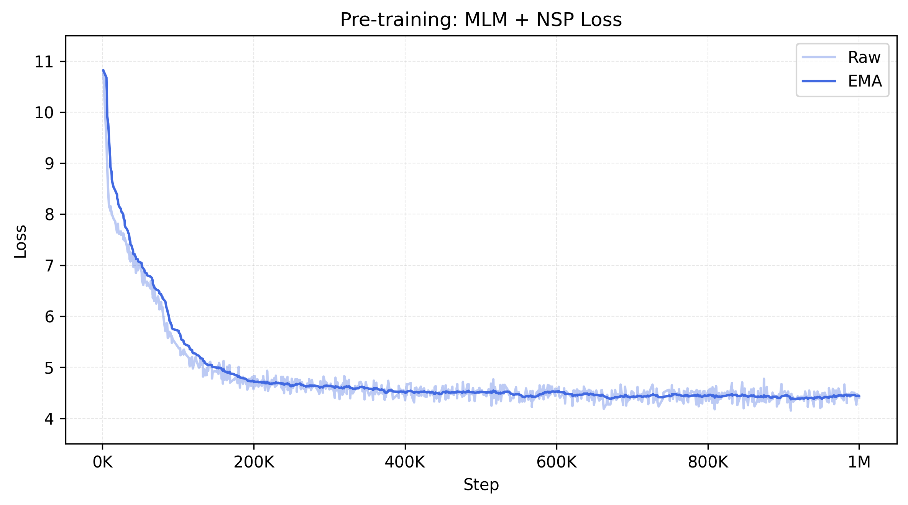

# BERT

This repository contains my personal implementation of **BERT (Bidirectional Encoder Representations from Transformers)** in PyTorch.  The project covers the **full pipeline**: pretraining on Wikipedia, fine-tuning on GLUE tasks, and evaluation against the [official BERT implementation](https://github.com/google-research/bert).
## 🌟 Introduction

Bidirectional Encoder Representations from Transformers (BERT) represents a seminal advancement in natural language understanding, enabling transfer learning at scale across a wide array of NLP tasks. Introduced by [Devlin et al. (2018)](https://arxiv.org/abs/1810.04805), BERT departs from previous approaches by leveraging **bidirectional self-attention**, allowing it to condition on both left and right context simultaneously during pre-training.

Unlike traditional left-to-right or right-to-left language models, BERT's design allows it to learn deeply contextualized representations that capture nuanced syntactic and semantic relationships across entire sequences. This is achieved via two unsupervised objectives—**masked language modeling (MLM)** and **next sentence prediction (NSP)**—which together enable the model to encode both intra-sentential and inter-sentential dependencies.

The success of BERT lies in its general-purpose architecture, which requires minimal modification across diverse downstream tasks. By fine-tuning the same pre-trained model on task-specific labeled data, BERT achieves state-of-the-art performance on a broad spectrum of benchmarks, most notably the [General Language Understanding Evaluation (GLUE)](https://openreview.net/pdf?id=rJ4km2R5t7) suite. 

This project is a **ground-up PyTorch implementation**, aiming to:
- Reimplement BERT architecture from scratch
- Pre-train on the English Wikipedia dataset
- Fine-tune on GLUE benchmark tasks
- Compare performance with the official BERT implementation
## 🏗️ Model Overview

This implementation reproduces the BERT Tiny encoder: a stack of 2 Transformers layers, hidden size 128, and 12 self-attention heads. Unlike the original Transformer introduced by [Vaswani et al. (2017)](https://arxiv.org/abs/1706.03762), BERT does not use causal masking but employs fully bidirectional self-attention.

Inputs are tokenized using **WordPiece** with a vocabulary of 30,522 words and used to construct sequences with the following structure:

```
[CLS] Sentence A [SEP] Sentence B [SEP]
```

The `[CLS]` token is used for classification tasks, while `[SEP]` and learned segment embeddings distinguish sentence boundaries. This unified input format allows BERT to handle both single-sentence and sentence-pair tasks with minimal architectural changes.

**Note:** This implementation uses the 🤗 transformers `BertTokenizer` to transform sentence pairs into the input sequence structure shown above
## 🔬 Pre-training

Pre-training is divided into two learning objectives: masked language modeling and next sentence prediction:
- **Masked Language Modeling (MLM):** Randomly masks 15% of tokens, replacing them with `[MASK]`, random tokens, or leaving them unchanged, forcing the model to predict masked tokens from context.
- **Next Sentence Prediction (NSP):** A binary classification task to determine whether one sentence follows another, crucial for learning discourse-level relations
	- 50% of the time, sentence `B` is the actual sentence that follows sentence `A`
	- 50% of the time, sentence `B` is sampled randomly from the corpus

The original implementation of BERT uses a document-level corpus composed of the BookCorpus (800M words) and the English Wikipedia (2,500M words) datasets. **Unfortunately, the original BookCorpus dataset is now defunct, so this implementation relies only on the Wikipedia dataset.**

**Note:** The original English Wikipedia corpus was dowloaded using the 🤗 datasets library, truncated, and split into sentences using the NLTK library.
- Original corpus: https://huggingface.co/datasets/wikimedia/wikipedia
- Processed dataset:  https://huggingface.co/datasets/rplacucci/wiki-sentences
## 🎯 Fine-tuning

Fine-tuning involves adding lightweight, **task-specific heads** on top of BERT while training the entire network **end-to-end**. The `[CLS]` representation is used for sentence-level tasks (e.g., sentiment, entailment), while token-level outputs can be used for tagging tasks.

The original implementation of BERT if fine-tuned and evaluated across a range of downstream natural language processing tasks. Here we focus on the **General Language Understanding Evaluation (GLUE) benchmark**: a collection of natural language understanding tasks that involve single-sentence or sentence pair classification.

**Note:** The GLUE dataset is hosted by 🤗 at https://huggingface.co/datasets/nyu-mll/glue.
## ⚙️ Installation

**1. Clone the repository**

```bash
git clone https://github.com/rplacucci/BERT.git
cd BERT
```

**2. Setup the local environment**

```bash
python -m venv .venv
source .venv/bin/activate
```

**3. Install dependencies**

```bash
pip install -r requirements.txt
```
## 🚀 Usage

### Pre-training

Pre-train on Wikipedia:
```bash
torchrun --standalone --nproc-per-node 4 train.py --bert_config tiny --batch_size 64 --max_len 512
```
### Fine-tuning

Fine-tune on a single GLUE task (e.g., QQP):
```bash
torchrun --standalone --nproc-per-node 4 tune.py --bert_config tiny --task_name qqp --lr 1e-4 --batch_size 64 --n_epochs 4
```

Alternatively, fine-tune on all GLUE tasks:
a) With constant learning rate and batch size
```bash
chmod +x run_tune_glue.sh
./run_tune_glue.sh
```

b) Across a range of learning rates and batch sizes
```bash
chmod +x run_tune_glue_params.sh
./run_tune_glue_params.sh
```
### Evaluation

Evaluate on all GLUE tasks:
```bash
chmod +x run_test_glue.sh
./run_test_glue.sh
```

Results for each task will be saved in tab-delimited files `./submission-bert-{bert_config}/{task_name}.tsv`, and the entire submission will be zipped in a folder `./submission-bert-{bert_config}.zip` that can be uploaded to https://gluebenchmark.com/.
### Key options

Adjust the pre-training and fine-tuning routines with the following parameters according to your computational resources:
- `--nproc-per-node` number of GPUs to train with (default: `4`)
- `--bert_config` BERT model architecture (default: `tiny`)
- `--task_name` name of GLUE task (default: `qqp`)
- `--batch_size` number of sentence pairs per batch (default: `64`)
- `--max_len` maximum sequence length (default: `512`)
- `--lr` constant learning rate for fine-tuning (default: `1e-4`)
- `--n_epochs` number of epochs for fine-tuning (default: `4`)
## 📊 Results

### Pre-training loss

The combined MLM + NSP loss follows the expected learning dynamics:
- The initial loss is approximately $\log V \approx 10.33$ (with vocabulary size $V=30,522$), which reflects the entropy of random token prediction. 
- The model undergoes a steep decline in the first ~100k steps as it rapidly acquires shallow lexical and syntactic regularities. 
- By ~200k steps, the rate of improvement slows markedly, and the loss plateaus near 4, consistent with prior BERT results and suggesting that further reductions would require additional training data (e.g., BookCorpus) or longer pretraining schedules.



**Note:** Pre-training took ~3.5 days on 4 NVIDIA A40 GPUs.
### GLUE Benchmark

The following table summarizes the GLUE scores on the test set and compares them with that from the official implementation. The scores are quite close to the official BERT-tiny despite this implementation being pre-trained **without the BookCorpus dataset**. 

BookCorpus provides long-form, narrative text with richer discourse structures and broader vocabulary than Wikipedia alone. This extra diversity helps BERT learn sentence-level coherence and semantic relationships. Without it, the model has less exposure to varied contexts and discourse patterns, which explains the systematically lower scores on many sentence-pair and reasoning tasks (e.g., QNLI), while single-sentence tasks (e.g., SST-2) remain largely unaffected.

| **Task** | **Metric**            | **Official BERT-tiny** | **My BERT-tiny** |
| -------- | --------------------- | :--------------------: | :--------------: |
| CoLA     | Matthew's corr        |          0.0           |       10.8       |
| SST-2    | Accuracy              |          83.2          |       83.1       |
| MRPC     | F1/Accuracy           |       81.1/71.1        |    79.9/69.2     |
| STS-B    | Pearson/Spearman corr |       74.3/73.6        |    66.7/63.3     |
| QQP      | F1/Accuracy           |       62.2/83.4        |    57.1/79.3     |
| MNLI-m   | Accuracy              |          70.2          |       66.3       |
| MNLI-mm  | Accuracy              |          70.3          |       66.3       |
| QNLI     | Accuracy              |          81.5          |       73.2       |
| RTE      | Accuracy              |          57.2          |       53.0       |
| WNLI     | Accuracy              |          62.3          |       55.5       |
| AX       | Matthew's corr        |          21.0          |       18.6       |
| Score    | ---                   |          64.2          |       61.1       |

**Note:** For each task, the best fine-tuning hyperparameters were selected from the lists below and used to train the models for each GLUE task over 4 epochs:
- batch size: 8, 16, 32, 64, 128
- learning rate: 2e-4, 1e-4, 5e-5, 3e-5
## 🔮 Future Work

- Implement RoBERTa-style pretraining (remove NSP, dynamic masking).
- Add support for longer sequence lengths via efficient attention.
- Experiment with domain-specific corpora (e.g., scientific text).
## 📚 References

- Devlin, J., Chang, M.-W., Lee, K., & Toutanova, K. (2019). _BERT: Pre-training of Deep Bidirectional Transformers for Language Understanding._
- Vaswani, A., et al. (2017). _Attention is All You Need._
- Wang, A., Singh, A., Michael, J., Hill, F., Levy, O., & Bowman, S. R. (2019). *GLUE: A Multi‑Task Benchmark and Analysis Platform for Natural Language Understanding.*
